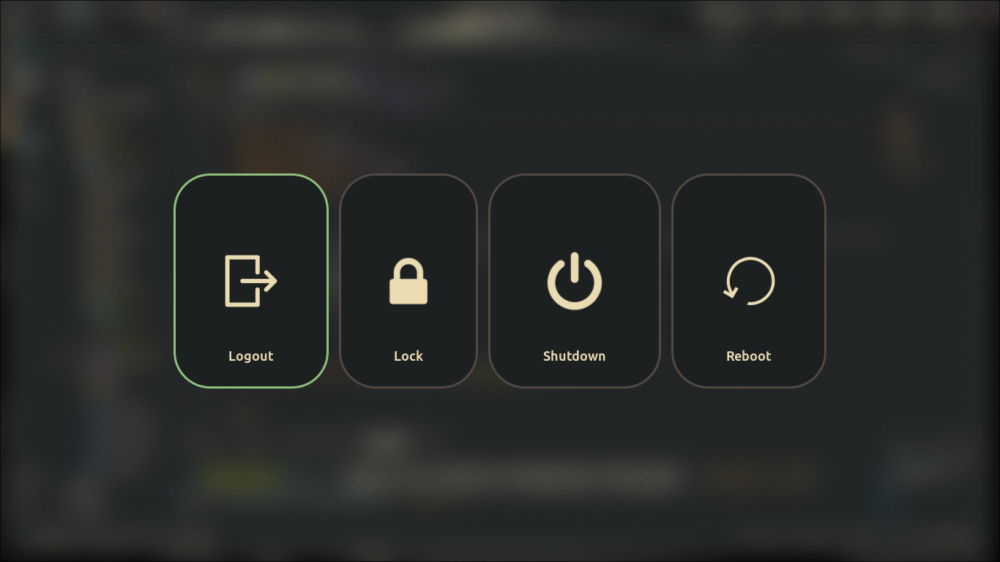

# NixOS-custom-iso

This is my personal NixOS (Flakes) configurations. Supports Linux and macOS (nix-darwin).




## Features
- Strong modularity and reuse linux and services modules
- Cross-platform support that spans Linux desktop and macOS (using nix-darwin with Homebrew)
- Includes prebuilt outputs for install-ISO, VirtualBox, per-user Home Manager configs and Darwin system.

## File Structures
```
modules/
  linux/              13 focused modules (boot, hardware, kernel, networking, 
                      display-manager, gaming, security, fonts, users, etc.)

  services/           Desktop services (SSH, media, location, torrent, RStudio)
  packages/           Custom package overlays (waybar-git, zscroll, etc.)
  
platforms/
  desktop/            Hyprland-based Linux desktop assembly
  darwin/             macOS (nix-darwin) assembly
  
hm-users/             Per-user Home Manager configs (mathewelhans, guest, macUser, nixos)
  mathewelhans/       Main user: imports config/ sub-modules (zsh, vim, waybar, 
                      vscode, kitty, rofi, yazi, hypridle, gammastep, etc.)
  
desktop-environment/
  hyprland/           Hyprland-specific config (hyprland.lua, conf/ fragments)
  
iso-configurations/   Custom ISO build definitions
hostname/             Hostname files (linux, mac) read at flake evaluation time
secrets/              agenix-encrypted secrets (Git-ignored)
flake.nix             Entry point: defines outputs and flake composition
flake.lock            Dependency lock file
disks.nix             Disk/filesystem configuration
stylix.nix            Theme / styling (colors, fonts applied system-wide)
nix-settings.nix      Nix daemon settings
```


## Getting Started
you can run 

## Contributing
- Open issues or PRs for improvements
- Run tests / linting (if any) before creating PR
- Add a short description of changes in PRs (follow Conventional Commits if you like)

## License
MIT — see `LICENSE`