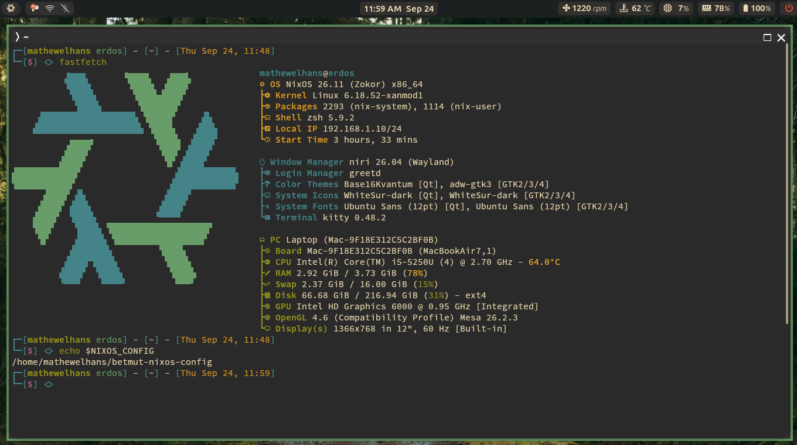
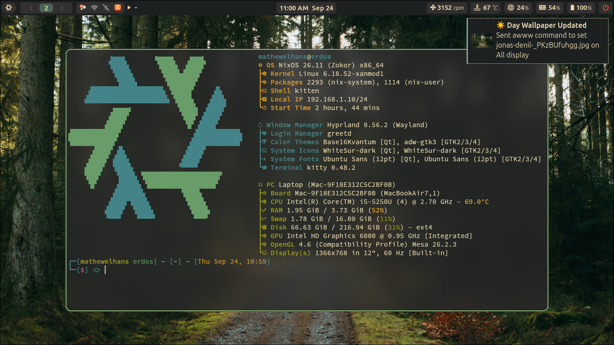
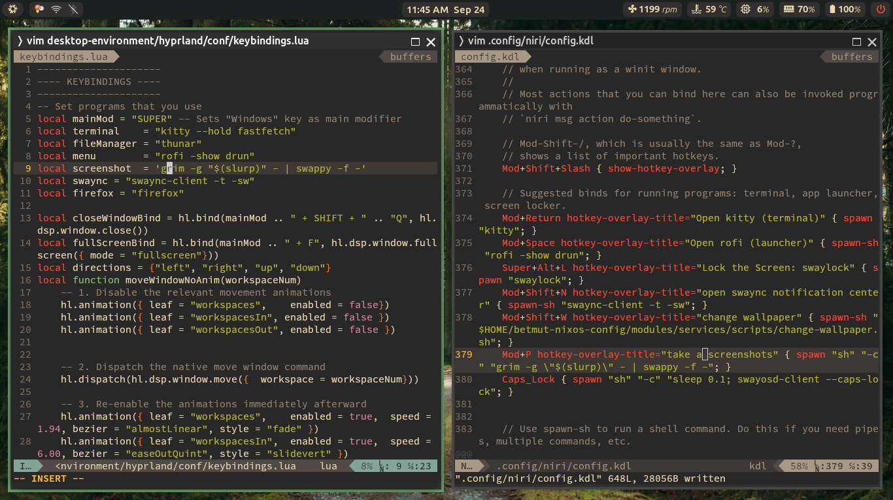

<div align="center">
  <h1>Betmut's NixOS Config</h1>
</div>
<div align="center">
  This is my personal NixOS (Flakes) configurations
</div>

## Wallpaper




## Features
- **Highly modular and reusable configuration**: Linux desktop and service modules are designed for composition and reuse —       easily extended into headless server configurations.
- **Cross-platform support**: works on NixOS/Linux desktops and macOS via `nix-darwin` (can integrate with Homebrew where appropriate).
- **Prebuilt outputs**: includes ready-made artifacts for an install ISO, per-user Home Manager profiles, and a Darwin system configuration.
- **Lix support**: experimental integration with Lix as an alternative package manager to address technical debt — faster evaluations and clearer, more readable error messages.
- **Time-aware wallpaper changer**: a small script that updates your wallpaper based on time of day; default keybinding `SUPER+SHIFT+W` (fully customizable) to change your wallpaper or `SUPER+W` to open `waypaper`.

## Default Component details
| Component       | Name                                                                                                                               | 
| :--------       | :--------:                                                                                                                         |
| Window Manager  | [Hyprland](https://github.com/hyprwm/hyprland)                                                                                     |
| Status bar      | [Waybar](https://github.com/Alexays/Waybar)                                                                                        |
| Color Theme     | [Gruvbox Dark](https://gruvbox.org/)                                                                                               |
| Kernel          | [XanMod](https://xanmod.org/)                                                                                                      |
| Launcher        | [rofi](https://github.com/davatorium/rofi)                                                                                         |
| Terminal        | [kitty](https://sw.kovidgoyal.net/kitty)                                                                                           |
| Shell           | [zsh](https://zsh.sourceforge.io/)                                                                                                 |
| Editor          | [VSCode](https://code.visualstudio.com/) - [vim](https://github.com/vim/vim)                                                       |
| File Manager    | [thunar](https://github.com/neilbrown/thunar)                                                                                      |
| Notifications   | [SwayNC](https://github.com/ErikReider/SwayNotificationCenter) - [libnotify](https://gitlab.gnome.org/GNOME/libnotify)             |
| Wallpapers      | [awww](https://codeberg.org/LGFae/awww) - [waypaper](https://github.com/anufrievroman/waypaper)                                    |
| Terminal Font   | [Hasklug Nerd Font Mono](https://www.programmingfonts.org/#hasklig)                                                                | 


## File Structures
```
.
├── desktop-environment/            # Hyprland-specific config (hyprland.lua, conf/ fragments)
│   └── hyprland
│
├── hm-users/                       # User-level configurations managed by Home Manager
│   ├── guest
│   ├── macUser
│   ├── mathewelhans
│   └── nixos
│
├── iso-configurations/             # Custom ISO build configurations
│   └── minimal-iso-config.nix      # Non-GUI custom ISO configurations (Including wl module for proprietary 
│                                     Broadcom driver support, NTFS/APFS support) 
│ 
├── modules/
│   ├── linux                       # 13+ focused modules (boot, docker, hardware, kernel, networking, 
│   │                                 display-manager, gaming, security, fonts, users, etc.)
│   │
│   ├── packages                    # Custom packages that fetch directly from the source code 
│   │                                 (waybar-git, zscroll, etc.)
│   │
│   └── services                    # Desktop services (SSH, media, location, torrent, 
│                                     RStudio server)
│
├── platforms/
│   ├── darwin                      # macOS (nix-darwin) system-level configurations
│   │
│   └── desktop                     # Linux desktop system-level configurations
│
├── hostname/                       # Hostname (linux, mac)
├── nix-settings.nix                # Nix daemon settings
├── disks.nix                       # Disk/filesystem configuration    
├── flake.nix                       # Entry point: defines outputs and flake composition
├── secrets                         # agenix-encrypted secrets
└── stylix.nix                      # Theme / styling (colors, fonts applied system-wide)
```


## Getting Started

### 1. Clone the repo
```
cd ~
git clone https://github.com/betmut/betmut-nixos-config.git
cd ~/betmut-nixos-config
```

### 2. Build the ISO
Download the [Nix package manager](https://nixos.org/download/) and ISO installer from the [official NixOS Website](https://nixos.org/download/) or build the custom ISO file by running
```
#if you clone the repo
nix build .#packages.x86_64-linux.minimal-iso

#if you run the flakes directly without cloning
nix build github:betmut/betmut-nixos-config#packages.x86_64-linux.minimal-iso
```

### 3. Rebuild the system configuration (NixOS)
```
sudo nixos-rebuild switch --flake .#<linux-hostname>
```

### 4. Rebuild the system configuration (MacOS)
Install [Nix-Darwin](https://github.com/nix-darwin/nix-darwin) and follow the installation instruction, and then, run this command:
```
darwin-rebuild switch --flake .#<mac-hostname>
```

Where you can change `<linux-hostname>` and `<mac-hostname>` at `hostname` directory

## License
MIT — see `LICENSE`
