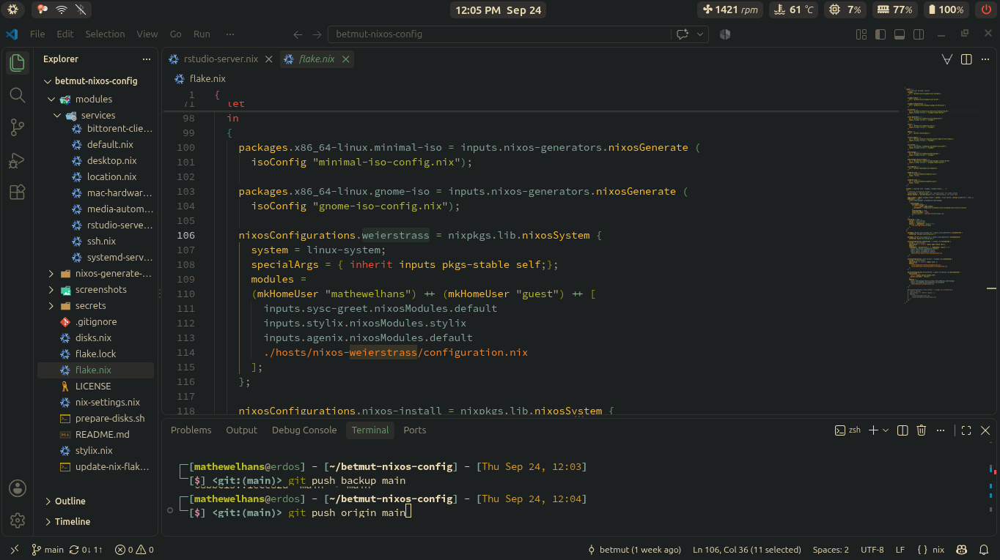

<div align="center">
  <h1>Betmut's NixOS Config</h1>
</div>
<div align="center">
  
  
  [](https://codeberg.org/betmut/betmut-nixos-config)
  [](https://github.com/betmut/betmut-nixos-config)

  <i>My personal NixOS (Flakes) configurations</i>
</div>

## Screenshots





## Features

- **Highly modular and reusable configuration**: Linux desktop and service modules are designed for composition and reuse.
- **Cross-platform support**: works on NixOS/Linux desktops and macOS via `nix-darwin` (can integrate with Homebrew where appropriate).
- **Prebuilt outputs**: includes ready-made artifacts for an install ISO, per-user Home Manager profiles, and a Darwin system configuration.
- **Lix support**: experimental integration with Lix as an alternative package manager to address technical debt — faster evaluations and clearer, more readable error messages.
- **Time-aware wallpaper changer**: a small script that updates your wallpaper based on time of day (located at `modules/services/scripts/change-wallpaper.sh`)

## Specifications
### Component details
| Component       | Name                                                                                                                               | 
| :--------       | :--------:                                                                                                                         |
| Window Manager  | [Hyprland](https://github.com/hyprwm/hyprland) - [niri](https://github.com/niri-wm/niri)                                                                                     |
| Status bar      | [Waybar](https://github.com/Alexays/Waybar)                                                                                        |
| Color Theme     | [Gruvbox Dark](https://gruvbox.org/)                                                                                               |
| Kernel          | [XanMod](https://xanmod.org/)                                                                                                      |
| Launcher        | [rofi](https://github.com/davatorium/rofi)                                                                                         |
| Logout Menu        | [wlogout](https://github.com/ArtsyMacaw/wlogout)                                                                                         |
| Display Manager        | greetd ([sysc-greet](https://github.com/Nomadcxx/sysc-greet) as the greeter)                                                                                         |
| Terminal        | [kitty](https://sw.kovidgoyal.net/kitty)                                                                                           |
| Shell           | [zsh](https://zsh.sourceforge.io/)                                                                                                 |
| Editor          | [VSCode](https://code.visualstudio.com/) - [vim](https://github.com/vim/vim)                                                       |
| File Manager    | [thunar](https://github.com/neilbrown/thunar)                                                                                      |
| Notifications   | [SwayNC](https://github.com/ErikReider/SwayNotificationCenter) - [libnotify](https://gitlab.gnome.org/GNOME/libnotify)             |
| Wallpapers      | [awww](https://codeberg.org/LGFae/awww) - [waypaper](https://github.com/anufrievroman/waypaper)                                    |
| Terminal Font   | [Hasklug Nerd Font Mono](https://www.programmingfonts.org/#hasklig)                                                                | 

### Machine's Hostnames
| Hostnames | Description |
|:----------|:-----------:|
| `weierstrass` | Main machine            |
| `erdos`     | Portable machine that installed on portable SSD           |

## File Structures
```
.
├── desktop-environment/            # WM and system-wide configs (hyprland, niri)
│    ├── swaync
│    ├── waybar
│    ├── wlogout
│    ├── niri 
│    └── hyprland
│
├── hm-users/                       # User-level configurations managed by Home Manager
│   ├── guest
│   ├── macUser
│   ├── mathewelhans
│   └── nixos
│
├── iso-configurations/             # Custom ISO build configurations
│   ├── gnome-iso-config.nix
│   └── minimal-iso-config.nix      # Non-GUI custom ISO configurations (Including wl module for proprietary 
│                                     Broadcom driver support, NTFS/APFS support) 
│ 
├── modules/
│   ├── linux                       # 13+ focused linux modules (boot, docker, hardware, kernel, 
│   │                                 networking, display-manager, gaming, security, fonts,
│   │                                 users, etc.)
│   │
│   ├── darwin                      # modules that focused on nix-darwin configurations
│   │
│   ├── packages                    # Custom packages that fetch directly from the source code 
│   │                                 (waybar-git, zscroll, etc.)
│   │
│   └── services                    # Desktop services (SSH, media, location, torrent, 
│                                     RStudio server)
│
├── hosts/
│   ├── darwin                      # macOS (nix-darwin) system-level configurations
│   │
│   └── nixos-<hostname>            # Default Linux system-level configurations 
│           
├── hostname/                       # Hostname (linux, mac)
├── nix-settings.nix                # Nix daemon settings
├── disks.nix                       # Disk/filesystem configuration    
├── flake.nix                       # Entry point: defines outputs and flake composition
├── secrets                         # agenix-encrypted secrets
├── prepare-disks.sh                # automated formatting and labelling partitions
├── update-nix-flakes.sh            # script for updating essential flake inputs
└── stylix.nix                      # Theme / styling (colors, fonts applied system-wide)
```


## Installation Guides

### 1. Clone the repo
```
cd ~
git clone https://github.com/betmut/betmut-nixos-config.git
cd ~/betmut-nixos-config
```

### 2. Download ISO image or Build the custom ISO image
Download the ISO image from the [official website](https://nixos.org/download/) or build the custom ISO file (include the `wl` module for proprietary Broadcom STA wireless driver support) by Installing [Nix package manager](https://nixos.org/download/) first, and then run:
```
#if you clone the repo
nix build .#packages.x86_64-linux.minimal-iso #minimal ISO
nix build .#packages.x86_64-linux.gnome-iso #GNOME ISO

#if you run the flakes directly without cloning
nix build github:betmut/betmut-nixos-config#packages.x86_64-linux.minimal-iso #minimal ISO
nix build github:betmut/betmut-nixos-config#packages.x86_64-linux.gnome-iso #GNOME ISO
```

### 3. Partitioning and Formating
Partitioning, formating, and mounting partitions guides can be see in [official NixOS manual](https://nixos.org/manual/nixos/stable/#sec-installation) or [Arch Installation Guide](https://wiki.archlinux.org/title/Installation_guide#Partition_the_disks).

You can run `prepare-disks.sh` script for automating Partitioning, formating, and mounting partitions processes (use on your own risk!).

### 4. Install full NixOS configurations (Flake approach) and set the user and root password
```
sudo nixos-install --flake .#<hostname>
```
As the last step, `nixos-install` will ask you to set the password for the root user, e.g.
```
setting root password...
New password: ***
Retype new password: ***
```
If you have a user account declared in your configuration.nix and plan to log in using this user, set a password before rebooting, e.g. for the `mathewelhans` user:
```
sudo nixos-enter --root /mnt -c 'passwd mathewelhans'
```

## Rebuild the Configurations

### Rebuild the system configurations (NixOS)
```
sudo nixos-rebuild switch --flake .#<hostname>
```

### Rebuild the system configurations (MacOS)
Install [Nix-Darwin](https://github.com/nix-darwin/nix-darwin) and follow the installation instruction, and then, run this command:
```
darwin-rebuild switch --flake .#<mac-hostname>
```

Where you can change `<mac-hostname>` at `hostname` directory

## Extra

You can also run the wallpaper changer script remotely by running:

```
bash <(curl -fsSL https://raw.githubusercontent.com/betmut/betmut-nixos-config/refs/heads/main/modules/services/scripts/change-wallpaper.sh)
```
Default keybinding for changing wallpaper is `SUPER+SHIFT+W`. Press `SUPER+W` to open `waypaper` (hyprland only).

You can run `update-nix-flakes.sh` script for updating the essential flake inputs for NixOS.

## License
MIT — see `LICENSE`
